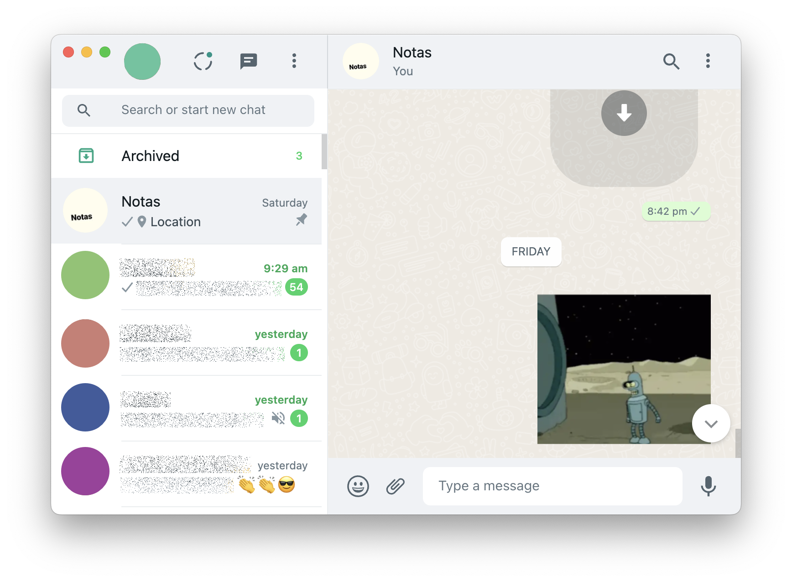

# whatsapp-webapp: An attempt to an ARM64 native Whatsapp client fully integrated with macOS

<p align="center">

</p>

It seems Whatsapp devs do not have plans to create an M1 version of the Whatsapp Web client so here is an attempt to build an ARM native client with support of notifications, badges and background refresh.

It also provides CSS and JS patches for correct functionality of the webapp.

Warning: This webapp could break as soon as Whatsapp devs change the format of their web.

To create a new standalone Whatsapp app:

```
brew install nativefier
./make.sh
```
